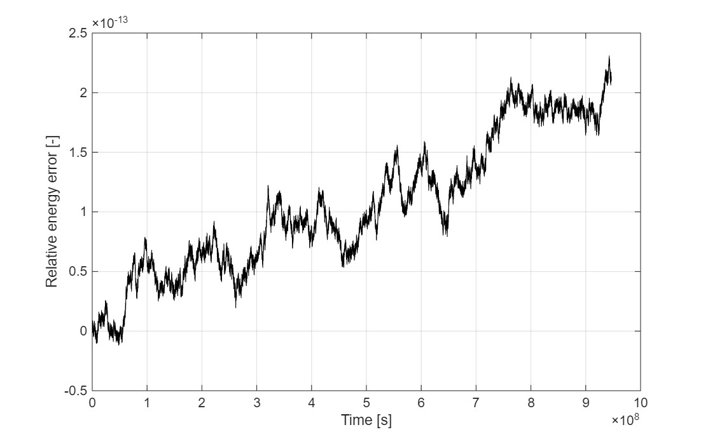
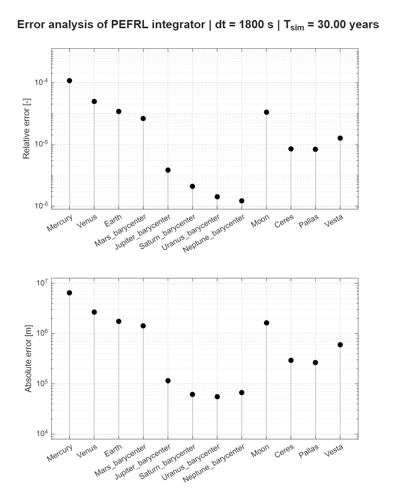

<h1 align="center">High-Precision Symplectic N-Body Orbital Propagator</h1>

<h3 align="center">
A fully vectorized, coordinate-free N-body numerical integrator designed for long-term orbital propagation, nodal regression analysis, and deep-space trajectory modeling.
</h3>

<p align="center">

</p>

<p align="center">
Example visualization of J2-induced Nodal Regression (RAAN precession) over long-term integration.
</p>

<hr>

## Core Overview

Built from scratch to maintain strict symplectic energy bounds and conserve system linear momentum (Barycenter stability). This engine bypasses standard test-mass approximations by implementing two-way reflex accelerations for gravitational harmonics ($J_2$).

## Core Architecture & Physics Engine

### 1. Symplectic Time Evolution (PEFRL)

Utilizing a 4th-order **Position Extended Forest-Ruth Like (PEFRL)** symplectic algorithm for phase-space volume conservation. It guarantees that the system's Shadow Hamiltonian remains bounded over multi-decade integrations.

### 2. **$J_2$** Harmonics

Implements a coordinate-free, fully algebraic formulation of the $J_2$ geopotential. By directly projecting local rotational poles ($\hat{z}_{local}$) onto the inertial frame, the engine eliminates the need for Direction Cosine Matrices (DCMs). This approach completely bypasses orthonormalization drift and drastically reduces computational overhead during evaluation.

### 3. Strict Momentum Conservation

Eliminates the standard non-conservation of total momentum in hierarchical N-body formulations. The engine calculates and applies reflex/recoil accelerations to oblate bodies, guaranteeing no artificial Barycenter drift. The system calculates the mutual perturbation symmetrically:

$$
\vec{a}_{reflex} = - \frac{\mu_j}{\mu_i} \cdot \vec{a}_{direct}(J_{2,i}, R_{eq,i}, \vec{r}_{ji})
$$

<hr>

## Validation & Error Analysis

The integrity of the physics engine is validated against theoretical limits and operational ephemerides:

### Shadow Hamiltonian Stability

Mathematical proof of engine stability. The relative pseudo-energy error remains bounded at the **O(10^-13)** level over a 30-year simulation of the Solar System (dt = 1800s).

> **Proof of Concept:** The high-frequency noise at the statistical error accumulation bound of $\approx 1.61 \times 10^{-13}$ confirms that symplectic bounds are perfectly maintained despite the sharp $1/r^4$ gradients introduced by the $J_2$ potential.

<p align="center">

</p>

<p align="center">
Strict energy conservation verified: Relative pseudo-energy error bounded at O(10^-13).
</p>

### JPL Horizons Benchmarking

System state outputs are actively benchmarked against NASA JPL Horizons data. Discrepancies (e.g., Earth's position error of ~1728 km over 30 years) reveal the theoretical limits of a purely Newtonian N-body model. These deviations are expected and directly result from:
* The absence of Einstein-Infeld-Hoffmann (EIH) general relativity corrections.
* Unmodeled perturbations from major celestial bodies.
* Lack of Barycentric Dynamical Time (TDB) dilation.



<hr>

## Repository Structure

```
├── ephemeris.json             # Mission config
├── test_ephemeris.json        # Simulation validation file
├── solar_system.m             # Main execution and visualization
├── README.md                  # Architecture documentation
├── assets/                    # Images and videos
└── tools/
   ├── spice_scraper.py        # Parameters generator for specified date
   └── spice-sim-data.tpc      # Additional planetary data

```

## Data Traceability & Credits

**Data Traceability:**

* Standard gravitational parameters ($\mu$) and initial state vectors (Epoch-of-Date) are sourced uniformly from the JPL DE440 ephemerides and standard planetary constants kernels (PCK) parsed via the SPICE Toolkit.

* Additional gravitational data (e.g., highly precise $J_2$ harmonics and 3D reference radii for Earth, Moon, and Jupiter) are rigorously sourced from scientific literature and NASA technical memorandums. This overriding data is explicitly documented within the custom `tools/spice-sim-data.tpc` kernel.

* Mission configuration and initial N-body state vectors mapped in ephemeris.json and test_ephemeris.json are generated using the `tools/spice_scraper.py`.

**Acknowledgments & Credits**

This project utilizes the **SPICE toolkit**:

>Acton, C.H.; "Ancillary Data Services of NASA's Navigation and Ancillary Information Facility;" Planetary and Space Science, Vol. 44, No. 1, pp. 65-70, 1996. [DOI 10.1016/0032-0633(95)00107-7](https://doi.org/10.1016/0032-0633(95)00107-7)

>Charles Acton, Nathaniel Bachman, Boris Semenov, Edward Wright; A look toward the future in the handling of space science mission geometry; Planetary and Space Science (2017); [DOI 10.1016/j.pss.2017.02.013](https://doi.org/10.1016/j.pss.2017.02.013)


and its Python wrapper **SpiceyPy**:

>Annex et al., (2020). SpiceyPy: a Pythonic Wrapper for the SPICE Toolkit. Journal of Open Source Software, 5(46), 2050, [DOI 10.21105/joss.02050](https://doi.org/10.21105/joss.02050)